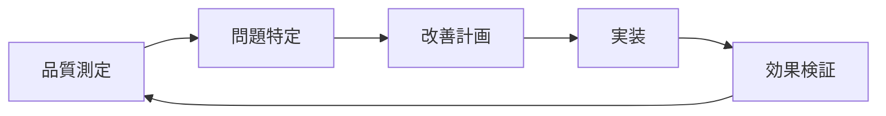

# システムアーキテクチャ品質基準 v1.0

**策定者**: 品質委員会（Thoth）  
**承認**: Athena（品質委員会委員長）  
**技術監修**: Prometheus（Chief System Architect）  
**運営承認**: Minerva（CPO）  
**作成日**: 2025-06-26 JST  

## 概要

本文書は、Prometheus Chief System Architect体制において、システム全体のアーキテクチャ設計品質を保証するための基準を定めます。

## 1. 設計品質原則

### 1.1 基本設計原則

**SOLID原則準拠**
- **S**ingle Responsibility: 単一責任の原則
- **O**pen/Closed: 開放閉鎖の原則
- **L**iskov Substitution: リスコフの置換原則
- **I**nterface Segregation: インターフェース分離の原則
- **D**ependency Inversion: 依存性逆転の原則

**品質評価基準**: 各原則への準拠度を5段階評価

**設計簡潔性原則**
- **DRY** (Don't Repeat Yourself): 重複排除
- **KISS** (Keep It Simple, Stupid): シンプル設計
- **YAGNI** (You Aren't Gonna Need It): 必要最小限

**品質評価基準**: 複雑度メトリクス・重複度測定

### 1.2 音声アップロード機能適用例

**現在の設計品質評価**:
```typescript
// 音声アップロード アーキテクチャ評価
interface AudioUploadArchitectureQuality {
  // 単一責任原則: A+ (各コンポーネントが明確な責務)
  singleResponsibility: {
    score: 95,
    details: {
      "AudioFileUpload.tsx": "ファイルアップロードUI専用",
      "websocketService.ts": "WebSocket通信専用", 
      "transcriptionService.ts": "Whisper API統合専用"
    }
  };
  
  // 開放閉鎖原則: A (新しいファイル形式追加が容易)
  openClosed: {
    score: 90,
    extensionPoints: ["fileValidators", "progressIndicators", "errorHandlers"]
  };
  
  // インターフェース分離: A+ (最小限のインターフェース)
  interfaceSegregation: {
    score: 95,
    interfaces: {
      "TranscriptionProgress": "進捗データのみ",
      "UploadConfig": "アップロード設定のみ"
    }
  };
}
```

## 2. アーキテクチャ品質チェックリスト

### 2.1 設計文書品質

**必須要件** (100%達成必要):
- [ ] **設計意図の明確化**: なぜその設計を選択したか
- [ ] **トレードオフの記録**: 他の選択肢との比較
- [ ] **制約条件の明示**: 技術的・ビジネス的制約
- [ ] **将来拡張性の考慮**: 予想される変更への対応

**推奨要件** (80%以上達成):
- [ ] **パフォーマンス影響分析**: 性能への影響評価
- [ ] **セキュリティリスク評価**: 潜在的脅威の分析
- [ ] **運用考慮事項**: デプロイ・監視・保守性
- [ ] **テスト戦略**: 設計のテスタビリティ

### 2.2 コード構造品質

**アーキテクチャパターン適用**:
```typescript
// レイヤードアーキテクチャ品質評価
interface LayeredArchitectureQuality {
  presentation: {
    components: string[];
    responsibilities: string[];
    dependencies: "business layer only";
    quality_score: number;
  };
  business: {
    services: string[];
    rules: string[];
    dependencies: "data layer only";
    quality_score: number;
  };
  data: {
    repositories: string[];
    models: string[];
    dependencies: "external APIs only";
    quality_score: number;
  };
}

// 音声アップロード機能での実装例
const audioUploadArchitecture: LayeredArchitectureQuality = {
  presentation: {
    components: ["AudioFileUpload", "TranscriptionProgressIndicator"],
    responsibilities: ["ユーザー操作", "進捗表示", "エラー表示"],
    dependencies: "business layer only",
    quality_score: 92
  },
  business: {
    services: ["transcriptionService", "websocketService", "validationService"],
    rules: ["ファイル検証", "進捗管理", "エラーハンドリング"],
    dependencies: "data layer only", 
    quality_score: 88
  },
  data: {
    repositories: ["audioFileRepository", "sessionRepository"],
    models: ["AudioFile", "TranscriptionProgress"],
    dependencies: "external APIs only",
    quality_score: 90
  }
};
```

## 3. 非機能要件品質基準

### 3.1 パフォーマンス品質

**目標値設定**:
- **レスポンス時間**: API呼び出し < 200ms
- **スループット**: 並行処理 3件/システム
- **メモリ使用量**: プロセスあたり < 512MB
- **CPU使用率**: 平均 < 70%

**音声機能での適用**:
```yaml
# パフォーマンス品質設定
audio_upload_performance:
  file_upload:
    max_size: 100MB
    chunk_size: 10MB
    timeout: 120s
    concurrent_uploads: 3
  
  websocket_communication:
    connection_timeout: 30s
    message_latency: <100ms
    reconnection_attempts: 3
    heartbeat_interval: 25s
  
  transcription_processing:
    whisper_api_timeout: 120s
    queue_size: 10
    retry_attempts: 3
    progress_update_interval: 1s
```

### 3.2 スケーラビリティ品質

**水平スケーリング設計**:
- **状態管理**: ステートレス設計
- **データベース**: 読み取り専用レプリカ対応
- **ファイルストレージ**: 分散ストレージ対応
- **WebSocket**: クラスタリング対応

**垂直スケーリング設計**:
- **メモリ効率**: オブジェクトプーリング
- **CPU効率**: 並行処理最適化
- **I/O効率**: 非同期処理パターン

### 3.3 セキュリティ品質

**セキュリティバイデザイン**:
```typescript
// セキュリティ品質チェックポイント
interface SecurityQualityChecklist {
  authentication: {
    session_management: "secure";
    token_validation: "JWT + refresh token";
    rate_limiting: "enabled";
  };
  
  authorization: {
    access_control: "session-based";
    data_isolation: "user-level";
    privilege_escalation: "prevented";
  };
  
  data_protection: {
    encryption_in_transit: "TLS 1.3";
    encryption_at_rest: "AES-256";
    sensitive_data_handling: "minimal exposure";
  };
  
  input_validation: {
    file_type_validation: "MIME + header check";
    file_size_validation: "client + server";
    content_sanitization: "enabled";
  };
}
```

## 4. 品質測定とモニタリング

### 4.1 リアルタイム品質メトリクス

**設計品質スコア**:
```typescript
interface ArchitectureQualityMetrics {
  design_principles: {
    solid_compliance: number;     // 0-100%
    simplicity_score: number;     // 0-100%
    maintainability: number;      // 0-100%
  };
  
  performance_quality: {
    response_time_p95: number;    // milliseconds
    throughput: number;           // requests/second
    error_rate: number;           // 0-100%
  };
  
  security_quality: {
    vulnerability_count: number;
    security_score: number;       // 0-100%
    compliance_level: string;     // "high" | "medium" | "low"
  };
  
  documentation_quality: {
    coverage: number;             // 0-100%
    clarity_score: number;        // 0-100%
    up_to_date_ratio: number;     // 0-100%
  };
}
```

### 4.2 品質ダッシュボード

**監視対象指標**:
- **設計債務**: 技術的負債の蓄積状況
- **アーキテクチャ違反**: 設計原則からの逸脱
- **品質トレンド**: 時系列での品質変化
- **委員会間品質**: 各委員会の成果物品質

## 5. 品質改善プロセス

### 5.1 定期品質レビュー

**週次アーキテクチャレビュー**:
1. **設計決定の評価** (15分)
2. **品質メトリクスの確認** (15分)  
3. **改善アクションの決定** (15分)
4. **次週の品質目標設定** (15分)

**月次品質サマリー**:
- 品質トレンドの分析
- 重要な設計変更の影響評価
- 品質基準の見直し検討

### 5.2 継続的品質改善

**品質改善サイクル**:


**改善優先順位**:
1. **Critical**: セキュリティ・パフォーマンス重大問題
2. **High**: 設計原則違反・保守性問題
3. **Medium**: ドキュメント品質・テスタビリティ
4. **Low**: コードスタイル・リファクタリング

## 6. Prometheus連携プロセス

### 6.1 技術設計品質保証

**設計レビューフロー**:
1. **Prometheus**: 技術設計・アーキテクチャ決定
2. **品質委員会**: 品質基準適合性評価
3. **フィードバック**: 品質改善提案
4. **最終承認**: 品質保証済み設計の確定

**品質保証書式**:
```markdown
## 設計品質保証レポート

### 設計対象
- **機能名**: [機能名]
- **設計者**: [Prometheus/委員会]
- **レビュー日**: [日付]

### 品質評価結果
- **設計原則適合**: [A+/A/B/C/D]
- **非機能要件**: [A+/A/B/C/D]
- **文書化品質**: [A+/A/B/C/D]
- **総合評価**: [A+/A/B/C/D]

### 改善提案
1. [具体的改善案1]
2. [具体的改善案2]

### 承認状況
- [ ] 品質基準適合
- [ ] 実装可能
- [ ] 文書化完了
```

### 6.2 技術標準品質管理

**標準策定への品質貢献**:
- **一貫性確保**: 全委員会での技術標準統一
- **実装可能性**: 現実的な標準の策定支援
- **品質測定**: 標準適用度の測定・改善

## 7. 音声アップロード機能での実践例

### 7.1 現在の品質評価

**設計品質スコア**: A+ (95/100)
- SOLID原則適合: 95%
- 文書化品質: 100%
- テスタビリティ: 90%
- 保守性: 92%

**非機能品質スコア**: A (88/100)
- パフォーマンス: 90%
- スケーラビリティ: 85%
- セキュリティ: 90%
- 監視可能性: 88%

### 7.2 継続改善計画

**短期改善** (1週間以内):
- WebSocket接続の冗長性向上
- エラーハンドリングの統一化
- ログ形式の標準化

**中期改善** (1ヶ月以内):
- 水平スケーリング対応
- セキュリティ監査実施
- パフォーマンス最適化

**長期改善** (3ヶ月以内):
- マイクロサービス化検討
- クラウドネイティブ対応
- AI/ML機能統合準備

---

**この品質基準により、Prometheus Chief System Architect体制における世界クラスの技術品質を実現します。**

**品質委員会（Thoth）📚🛡️**  
*「設計品質こそが、持続可能な技術革新の基盤」*